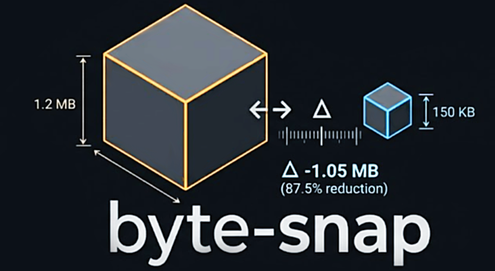

# byte-snap

> A byte counter for your build. Snap before, snap after, see the delta.

[](https://www.npmjs.com/package/byte-snap)
[](https://bundlephobia.com/package/byte-snap)
[](https://www.npmjs.com/package/byte-snap)
[](./LICENSE)



> ⭐ **Star [this repository](https://github.com/jayf0x/byte-snap) if you'd like to support its growth**

## Install

```sh
npm i -D byte-snap
# or
bun add -d byte-snap
```

## Quick start

```js
// vite.config.js
import { snapBuild } from 'byte-snap';

export default {
  plugins: [snapBuild.vite({ dir: 'dist' })],
};
```

```sh
$ vite build
✓ built in 1.24s

your-package
────────────
264.36 KB → 86.21 KB
saved: 178.15 KB (67.39% smaller)
files: 4 → 2
```

| Option | Default  | Description          |
| ------ | -------- | -------------------- |
| `dir`  | `'dist'` | Directory to measure |

> `measureSize` is a deprecated alias of `snapBuild` — same plugin, kept for back-compat.

## Measure one plugin

`snapPlugins` shows what a single plugin (or group) changed in the final build, by rebuilding
without it and diffing. Drop it into `plugins: [...]` where that plugin would go:

```js
// vite.config.js
import { snapPlugins } from 'byte-snap';
import compress from 'some-compression-plugin';

export default {
  plugins: [snapPlugins([compress], { buildCmd: 'vite build' })],
};
```

```sh
$ vite build

size: plugin some-compression-plugin
────────────
1.91 KB → 338.00 B
saved: 1.58 KB (82.74% smaller)
files: 1 → 1
```

`buildCmd` is **required** — it's the exact command re-run (once, in a child process) to produce
the without-plugin baseline, so the comparison is byte-identical except for the measured plugin.

| Option     | Required | Description                                             |
| ---------- | -------- | ------------------------------------------------------- |
| `buildCmd` | yes      | The build command re-run to produce the baseline build. |

## Custom usage

Two functions. Snapshot, do the work, diff:

```js
import { diff, snap } from 'byte-snap';

const before = snap.path('./dist'); // file or directory (recursive)
await runYourMinifier(); // eg. codemod, image squash, anything
const after = snap.path('./dist');

diff(before, after).print();
```

Want the numbers? `.json()`:

```js
const stats = diff(before, after).json();
// {
//   beforeBytes: 1268776, afterBytes: 968496,
//   savedBytes: 300280, savedPercent: 23.67,
//   beforeFiles: 34, afterFiles: 34, fileDelta: 0
// }
```

## Exotic use cases

**Fail build if a custom plugin didn't save enough**

```js
const before = snap.path('./dist');
await runYourMinifier();

const { savedBytes } = diff(before, snap.path('./dist')).json();

// expect at least 100 bytes saved
if (savedBytes < 100) {
  console.error(`Baseline not met. Saved only ${savedBytes} bytes 🚨`);
  process.exit(1);
}
```

**Compare gzip vs brotli on a single file**

```js
import { diff, snap } from 'byte-snap';
import { readFileSync } from 'node:fs';
import { brotliCompressSync, gzipSync } from 'node:zlib';

const raw = readFileSync('dist/index.js');
diff(snap.buffer(raw), snap.buffer(gzipSync(raw))).print();
diff(snap.buffer(raw), snap.buffer(brotliCompressSync(raw))).print();
```

**Measure a raw string transform**

```js
diff(snap.text(source), snap.text(minify(source))).print();
```

## API

| Call                  | Returns / does                                                  |
| --------------------- | --------------------------------------------------------------- |
| `snap.path(target)`   | Snapshot a file or directory (recursive). Missing path → empty. |
| `snap.text(str)`      | Snapshot a string's UTF-8 byte length.                          |
| `snap.buffer(buf)`    | Snapshot a `Buffer` or `ArrayBuffer`.                           |
| `diff(a, b)`          | Compare two snapshots → `{ print(title?), json() }`.            |
| `snapBuild.vite()`    | Whole-build plugin (and `.rollup`, `.webpack`, `.esbuild`, …).  |
| `snapPlugins([p], o)` | Plugin array measuring what plugin `p` changed (`o.buildCmd`).  |

Each snapshot also exposes per-file detail: `{ files, bytes: { total, average, largest, smallest }, entries }`.

## License

[MIT](./LICENSE) © jayF0x
